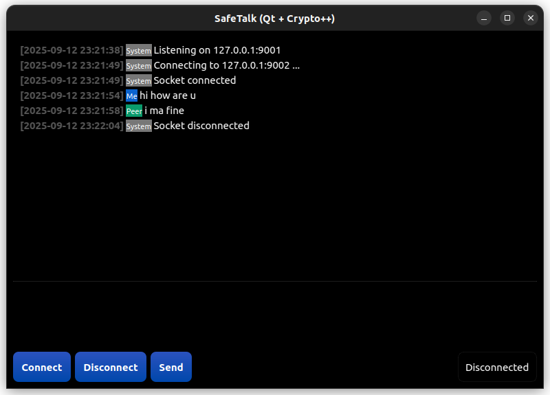

# 🛡️ SafeTalk

**SafeTalk** is a lightweight, end-to-end encrypted chat app built with **Qt** and **Crypto++**.  
It uses **RSA** for key exchange and **AES-GCM** for secure message transmission over TCP sockets.  

The project includes an easy deployment script for Linux that sets up separate run directories for two peers (A and B).  

---

## ✨ Features

- 🔐 End-to-end encryption (RSA + AES-GCM).  
- ⚡ Lightweight Qt GUI.  
- 🌍 Works peer-to-peer over local network.  
- ⚙️ Easy configuration via JSON.  
- 🐧 Fully Linux-compatible (tested on Ubuntu/Debian-based distros).  

---

## 📦 Requirements

Install the following dependencies on Linux:

```bash
sudo apt update
sudo apt install -y build-essential cmake qtbase5-dev libcrypto++-dev
```

---

## 🚀 Build & Deploy

Clone and set up the project:

```bash
# Get the source
git clone https://github.com/Cyber-Security-July-Dec-2025/B4
cd safetalk

# Run deploy script (does a clean build + setup run folders)
chmod +x deploy.sh
./deploy.sh
```

If successful, you’ll see:

```
==> Build successful: /home/username/B4/build/securechat
==> Deploy done.
Run the two instances in separate terminals:
  Terminal 1: cd /home/username/B4/run-A && ./start.sh
  Terminal 2: cd /home/username/B4/run-B && ./start.sh
```

---

## ⚙️ Configuration

Each run folder (`run-A`, `run-B`) contains a `config.json` file. Example:

```json
{
  "my_private_key": "keys/my_private.key",
  "my_public_key": "keys/my_public.key",
  "peer_public_key": "keys/peer_public.key",
  "listen_ip": "0.0.0.0",
  "listen_port": 9001,
  "peer_ip": "192.168.1.42",
  "peer_port": 9002,
  "rsa_bits": 2048,
  "aes_key_bytes": 32,
  "aes_iv_bytes": 12
}
```

🔑 Notes:  
- `my_private_key` → Your private RSA key.  
- `my_public_key` → Your public RSA key.  
- `peer_public_key` → The peer’s public key.  
- `listen_ip` should usually remain `"0.0.0.0"`.  
- Use **LAN IPs** (e.g., `192.168.x.x`) instead of `127.0.0.1`.  

---

## 🖥️ Running

Open **two terminals**:

```bash
# Terminal 1
cd run-A
./start.sh

# Terminal 2
cd run-B
./start.sh
```

The peers should connect and allow secure chat.  

---

## 🌐 Finding Your LAN IP

On Linux:

```bash
hostname -I
```

or

```bash
ip addr show
```

Look for an address like `192.168.x.x` or `10.x.x.x`.  

---

## 🔧 Troubleshooting

- **`failed to open config.json`** → Ensure the file exists in the `run-A` / `run-B` folder.  
- **App not showing GUI** → Check Qt installation, and ensure `export QT_QPA_PLATFORM=xcb` is set (done automatically in `start.sh`).  
- **Peers not connecting** → Verify both are on the same LAN and ports are open in firewall.  

---

## 📸 Demonstration

Below is a sample screenshot of **SafeTalk** in action:



This image shows two peers exchanging encrypted messages using the Qt-based interface.


---

## 📜 License

MIT License. Free to use and modify.  
